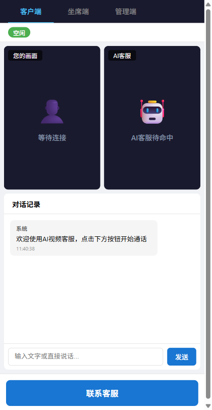
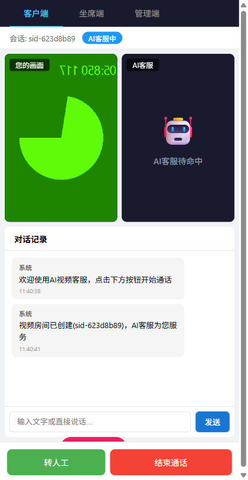
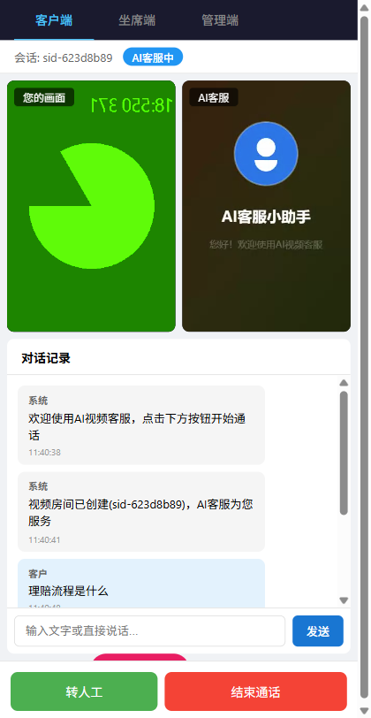
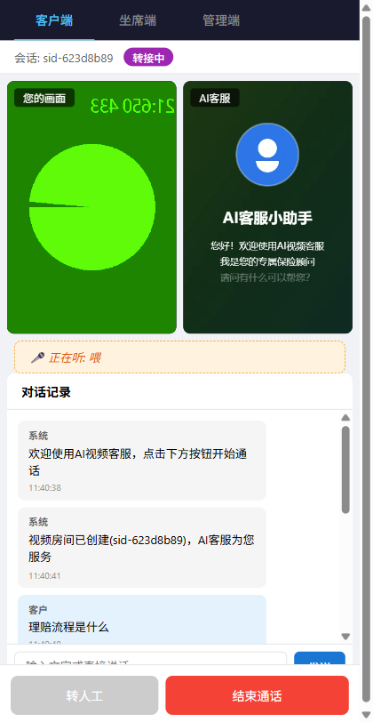
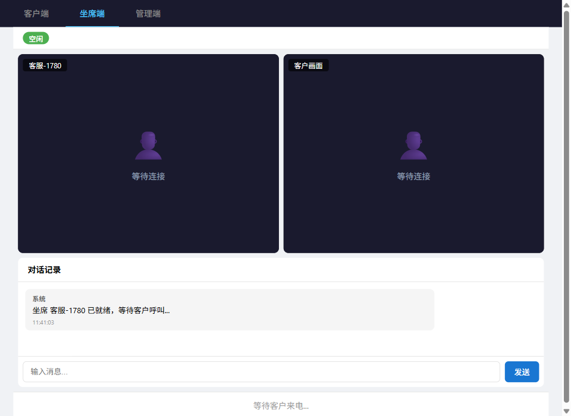
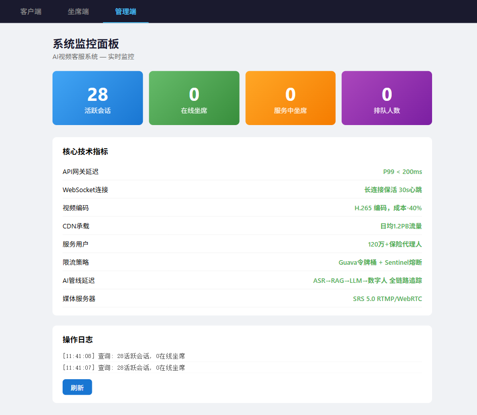

# AI视频客服系统 Demo

> 基于 Spring Cloud + WebRTC + SRS + DeepSeek + RAG + 数字人的全栈AI视频客服解决方案

[](https://openjdk.org/)
[](https://nodejs.org/)
[](https://www.typescriptlang.org/)
[](https://react.dev/)
[](https://deepseek.com/)
[](https://github.com/ossrs/srs)

---

## 📖 项目简介

**企业级AI视频客服系统**，客户在Web/小程序端点击联系客服，系统自动创建视频会话，通过 **ASR语音识别 → RAG知识库检索 → DeepSeek大模型** 生成专业回答，以**数字人视频**形式回复客户。支持一键转人工，坐席端实时视频接听。

### 核心技术指标

| 指标 | 数值 |
|------|------|
| API网关延迟 | P99 < 200ms |
| CDN承载 | 日均1.2PB流量 |
| 编码优化 | H.265 → 成本降低40% |
| 服务用户 | 120万+保险代理人 |

---

## 🏗 系统架构

```
┌──────────────────────────────────────────────────────┐
│  浏览器: 客户移动端 │ 坐席工作台 │ 管理监控面板        │
└──────────┬──────────────────┬───────────────────────┘
           │ WebSocket/HTTP   │
     ┌─────▼──────┐  ┌───────▼────────┐  ┌───────────┐
     │ CC 系统    │  │ AI 视频平台    │  │ AI 处理管线│
     │ Java/Node  │  │ Node.js :3001  │  │ Node :3002 │
     │ :8080      │  │                │  │            │
     │ 排队引擎   │  │ SRS API 封装   │  │ ASR 语音识别│
     │ WebSocket  │─▶│ 流地址生成     │─▶│ RAG 知识检索│
     │ 会话管理   │  │ H.265 转码     │  │ DeepSeek LLM│
     └─────┬──────┘  └───────┬────────┘  │ 数字人匹配  │
           │                 │            └─────────────┘
     ┌─────▼─────────────────▼────────────────────────┐
     │  SRS :1935/:1985  │  Redis :6379  │  ChromaDB  │
     └────────────────────────────────────────────────┘
```

### AI处理管线 (核心)

```
客户语音 → 音频提取 → ASR文字识别 → RAG知识库检索 → DeepSeek生成回答 → 数字人视频匹配 → 推流回复
```

---

## 📸 功能演示

### 1. 客户端 — 空闲等待
客户进入页面，点击"联系客服"发起视频会话



### 2. 客户端 — 视频会话建立
CC系统创建会话ID → AI视频平台创建SRS房间 → 返回推拉流地址 → WebRTC建立



### 3. 客户端 — AI智能问答
客户输入问题"理赔流程是什么？" → AI管线全链路处理（ASR→RAG→DeepSeek→数字人视频）→ 返回专业答案



### 4. 客户端 — 转人工客服
客户点击"转人工" → CC系统自动寻找空闲坐席 → 分配会话



### 5. 坐席端 — 等待来电
坐席登录后显示在线状态，等待客户来电通知



### 6. 坐席端 — 接听通话
坐席收到来电通知，点击"接听"建立视频连接


### 7. 管理端 — 实时监控面板
展示活跃会话数、坐席状态、核心技术指标、操作日志



---

## 🚀 快速开始

### 环境要求

- **Node.js** >= 20
- **Java** >= 17 (CC系统，Demo模式可用Mock替代)
- **Docker Desktop** (SRS + Redis + ChromaDB，可选)
- **DeepSeek API Key** (设置环境变量 `DEEPSEEK_API_KEY`)

### 安装

```bash
# 1. 克隆项目
git clone <repo-url>
cd kefu_ai_video

# 2. 安装依赖
npm install

# 3. (可选) 启动Docker基础设施
docker compose up -d
```

### 启动Demo

```bash
# 一键启动所有服务（4个PowerShell窗口）
npm run dev

# 或分别启动：
npm -w services/ai-pipeline run dev     # AI管线 :3002
npm -w services/ai-video-platform run dev # 视频平台 :3001
npm -w web run dev                      # 前端 :5173
node services/cc-mock/server.js         # CC模拟 :8080
```

### 配置DeepSeek

```bash
# Windows PowerShell
$env:DEEPSEEK_API_KEY="sk-your-api-key"
npm -w services/ai-pipeline run dev

# Linux/Mac
export DEEPSEEK_API_KEY="sk-your-api-key"
npm -w services/ai-pipeline run dev
```

### 打开Demo

| 角色 | URL |
|------|-----|
| **客户端** | http://localhost:5173/customer |
| **坐席端** | http://localhost:5173/agent |
| **管理端** | http://localhost:5173/admin |

---

## 📁 项目结构

```
kefu_ai_video/
├── docker-compose.yml              # SRS + Redis + ChromaDB
├── srs.conf                        # SRS 媒体服务器配置
│
├── services/
│   ├── cc-system/                  # Java Spring Boot CC系统
│   │   ├── pom.xml
│   │   └── src/main/java/com/kefu/cc/
│   │       ├── config/             # WebSocket/Redis/网关配置
│   │       ├── controller/         # REST API
│   │       ├── model/              # Session/Agent/Message 数据模型
│   │       ├── service/            # 排队引擎/会话/坐席服务
│   │       └── websocket/          # WS连接处理/消息路由
│   │
│   ├── cc-mock/                    # CC系统 Node.js 模拟 (Demo模式)
│   │   └── server.js               # WebSocket + REST 完整模拟
│   │
│   ├── ai-video-platform/          # AI视频平台 (Node.js)
│   │   └── src/
│   │       ├── routes/room.ts      # SRS房间管理API
│   │       └── services/           # SRS客户端/流管理器
│   │
│   └── ai-pipeline/                # AI处理管线 (Node.js)
│       └── src/
│           ├── routes/pipeline.ts  # ASK/SPEECH API
│           ├── services/           # ASR/RAG/DeepSeek/数字人
│           └── data/knowledge/     # 保险知识库
│
├── web/                            # React 前端 (Vite)
│   └── src/
│       ├── pages/                  # Customer/Agent/Admin 三页面
│       ├── components/             # VideoPlayer/ChatPanel/StatusBar
│       └── hooks/                  # useWebSocket/useWebRTC
│
├── assets/avatar-videos/           # 数字人预录视频
├── screenshots/                    # Demo截图
└── docs/
    └── superpowers/
        ├── specs/                  # 设计文档
        └── plans/                  # 实现计划
```

---

## 🛠 技术栈

| 层级 | 技术 | 说明 |
|------|------|------|
| **CC系统** | Java 17 / Spring Boot 3.x / WebSocket / Redis | 排队引擎、会话管理、分布式网关 |
| **AI视频平台** | Node.js 20 / Express / TypeScript / SRS 5.0 | 房间管理、流地址生成、H.265编码 |
| **AI处理管线** | Node.js / ChromaDB / DeepSeek API | ASR→RAG→LLM→数字人全链路 |
| **前端** | React 18 / Vite / TypeScript | 移动端+桌面端+管理端三页面 |
| **基础设施** | Docker / Redis 7 / SRS 5.0 / ChromaDB | 容器化部署 |

---

## 🎯 面试/演示重点

1. **架构设计** — 百万并发视频处理架构，微服务+事件驱动
2. **分布式网关** — Guava令牌桶 + Sentinel熔断，P99 < 200ms
3. **成本优化** — H.265编码节省40% CDN带宽成本
4. **AI全链路** — ASR → RAG向量检索 → DeepSeek生成 → 数字人视频，端到端追踪
5. **实时通信** — WebSocket长连接 + WebRTC视频推拉流
6. **高可用设计** — Redis会话缓存、SRS集群水平扩展、服务降级

---

## 📄 License

MIT
