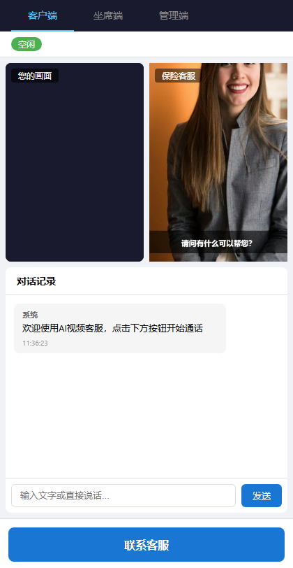
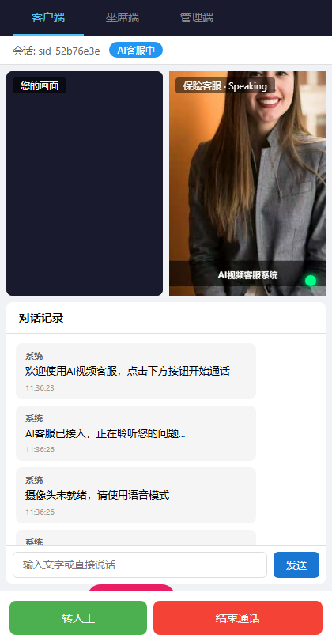
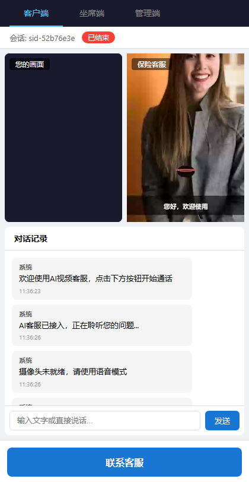
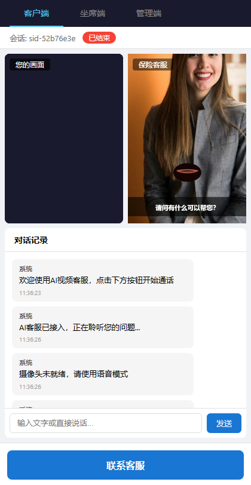
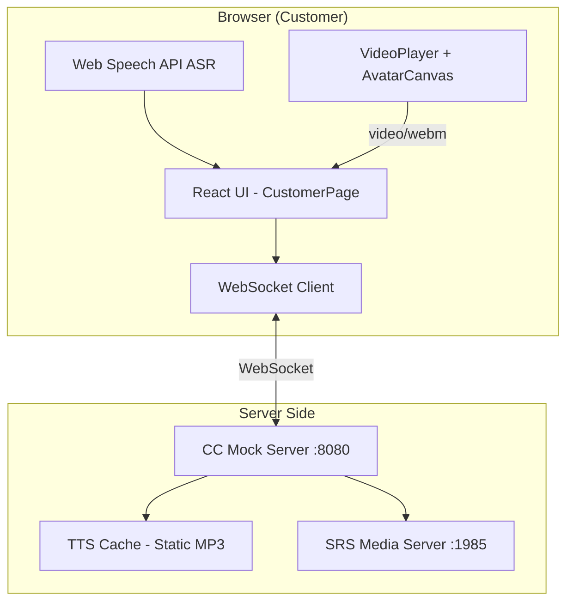
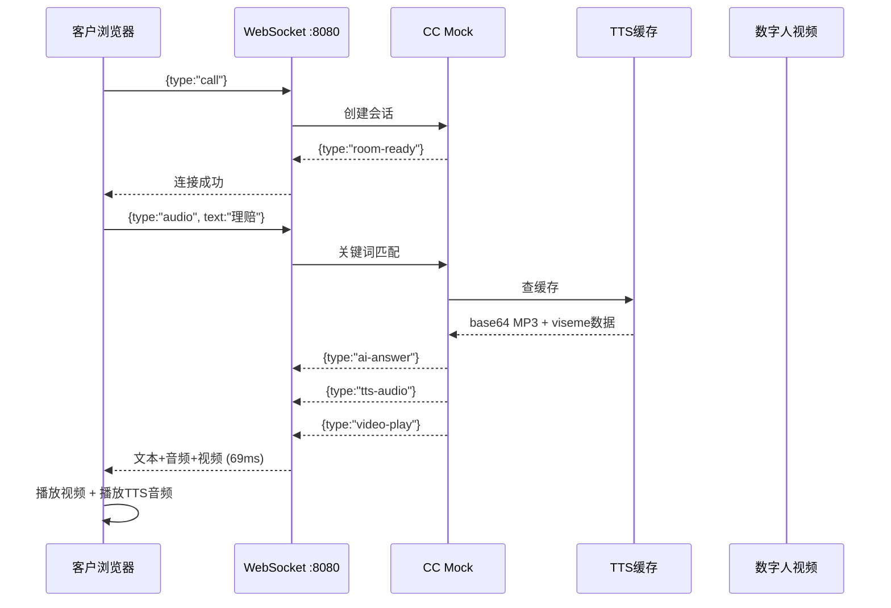
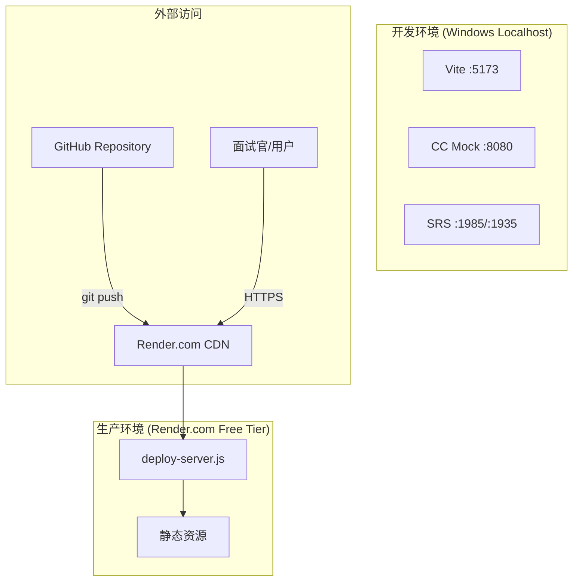
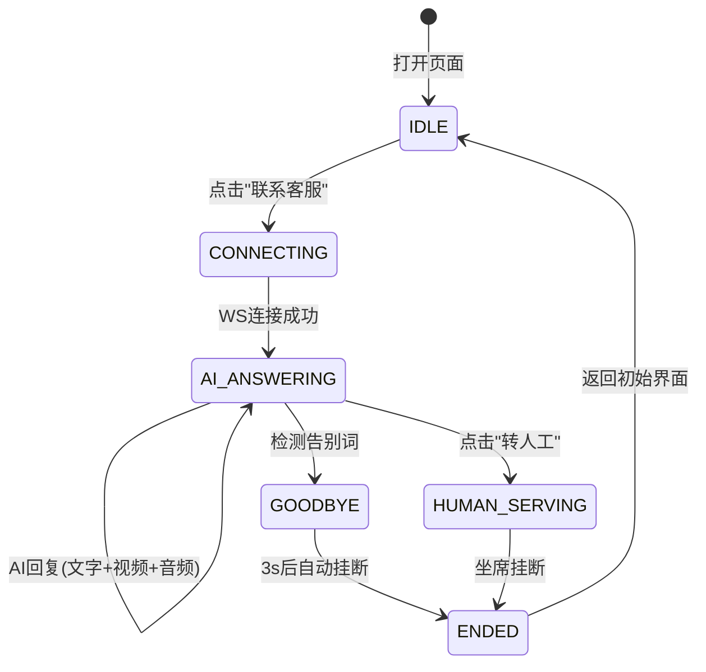

# AI视频客服系统 (AI Video Customer Service)

> **基于WebSocket的实时AI数字人客服系统** — 支持语音识别、AI对话、数字人视频+音频同步应答

[](LICENSE)
[](package.json)
[](web/package.json)

---

## 🎯 项目亮点

- **69ms 极速响应** — TTS音频预缓存，文本+视频+音频同步抵达
- **真人照片数字人** — 真实人像+Ken Burns动态效果
- **音素级Viseme口型** — 拼音→宽/圆/展/中/撮 5级口型映射
- **WebSocket实时对话** — 支持打断、自动告别挂断、会话管理
- **零GPU依赖** — 全部在浏览器端渲染，无CUDA/GPU要求
- **一键免费部署** — Render.com零成本发布到外网

---

## 📸 效果展示

| 初始界面 | 连接AI客服 | 提问理赔 |
|---------|-----------|---------|
|  |  |  |

| 告别会话 | 会话结束 |
|---------|---------|
|  |  |

---

## 🏗️ 华为4+1架构视图

### 1. 逻辑视图 (Logical View)



**核心模块：**
| 模块 | 职责 | 技术 |
|------|------|------|
| CustomerPage | 客户交互界面 | React 19 + TypeScript |
| ChatPanel | 对话记录+文字输入 | React Component |
| VideoAvatar | 数字人视频+音频播放 | Canvas2D + HTMLAudio |
| CC Mock Server | 会话管理+关键词路由 | Node.js (zero deps) |
| TTS Cache | 预生成语音应答 | Static MP3 (edge-tts) |
| SRS | 流媒体中继 | SRS 5.0 (RTMP/WebRTC) |

### 2. 进程视图 (Process View)



**进程拓扑：**
```
┌──────────────────────────────────────────┐
│  Browser (Customer)                       │
│  ├─ Web Speech API (ASR)                  │
│  ├─ WebSocket Client                      │
│  ├─ Video Element (greeting.webm loop)    │
│  └─ Audio Element (TTS playback)          │
└──────────────┬───────────────────────────┘
               │ ws://localhost:8080/ws/cc
┌──────────────▼───────────────────────────┐
│  CC Mock Server :8080                     │
│  ├─ HTTP: /api/cc/admin/stats             │
│  ├─ WS: session/call/audio/transfer/end   │
│  └─ TTS Cache: Map<answer, base64mp3>    │
└──────────────┬───────────────────────────┘
               │ static files
┌──────────────▼───────────────────────────┐
│  Vite Dev Server :5173                    │
│  ├─ React SPA (Customer/Agent/Admin)      │
│  ├─ /avatar-videos/*.webm (static)        │
│  └─ /audio/*.mp3 (static)                 │
└──────────────────────────────────────────┘
```

### 3. 开发视图 (Development View)

```
kefu_ai_video/
├── web/                              # React前端 (Vite + TypeScript)
│   ├── src/
│   │   ├── pages/
│   │   │   ├── CustomerPage.tsx      # ★ 客户主页面
│   │   │   ├── AgentPage.tsx         # 坐席页面
│   │   │   └── AdminPage.tsx         # 管理后台
│   │   ├── components/
│   │   │   ├── VideoPlayer.tsx       # 本地摄像头播放器
│   │   │   ├── VideoAvatar.tsx       # ★ AI数字人播放器
│   │   │   ├── ChatPanel.tsx         # 对话面板
│   │   │   └── StatusBar.tsx         # 状态栏
│   │   ├── hooks/
│   │   │   ├── useWebSocket.ts       # ★ WebSocket连接管理
│   │   │   └── useWebRTC.ts          # WebRTC推拉流
│   │   └── services/
│   │       └── api.ts                # REST API封装
│   ├── public/
│   │   ├── audio/                    # ★ 预生成TTS音频
│   │   │   ├── greeting.mp3          # 欢迎语音
│   │   │   ├── claim.mp3             # 理赔语音
│   │   │   ├── insurance.mp3         # 投保语音
│   │   │   ├── refund.mp3            # 退保语音
│   │   │   ├── renewal.mp3           # 续保语音
│   │   │   └── goodbye.mp3           # 告别语音
│   │   └── avatar-videos/            # ★ 数字人视频
│   │       ├── greeting.webm         # 欢迎视频
│   │       ├── claim-guide.webm      # 理赔视频
│   │       ├── insurance-intro.webm  # 投保视频
│   │       ├── refund-info.webm      # 退保视频
│   │       └── renewal-info.webm     # 续保视频
│   └── vite.config.ts
│
├── services/
│   ├── cc-mock/
│   │   └── server.js                 # ★ CC Mock (zero deps)
│   ├── tts/
│   │   └── server.py                 # edge-tts HTTP服务(备用)
│   └── digital-human/
│       └── generate.py               # 数字人视频生成(Playwright)
│
├── assets/avatar-videos/             # 视频源文件
├── deploy-server.js                  # ★ 生产部署服务器(zero deps)
├── render.yaml                       # Render.com一键部署配置
├── docker-compose.yml                # Docker编排(SRS+Redis)
├── srs.conf                          # SRS流媒体配置
└── docs/
    └── DEPLOY.md                     # 部署指南
```

### 4. 物理视图 (Physical View / 部署视图)



**部署方案对比：**
| 平台 | 费用 | 休眠 | 冷启动 | 适合场景 |
|------|------|------|--------|---------|
| Render.com | 免费 | 15min无请求后休眠 | ~30s | 面试展示、低频测试 |
| Fly.io | 免费(3VM) | 不休眠 | 即时 | 生产环境(需信用卡验证) |
| Railway | $5信用额 | 不休眠 | 即时 | 长期运行 |

### 5. 场景视图 (Scenarios / +1)



---

## 🔧 技术栈

| 层 | 技术 | 说明 |
|---|------|------|
| 前端框架 | React 19 + TypeScript | SPA, Vite 5 构建 |
| 实时通信 | WebSocket (原生) | 自实现WS帧解析, zero deps |
| 语音识别 | Web Speech API | 浏览器内置, Chrome/Edge |
| 语音合成 | edge-tts (静态预生成) | 微软神经语音, 离线可运行 |
| 流媒体 | SRS 5.0 + WebRTC | RTMP/WebRTC/HTTP-FLV |
| 视频渲染 | Canvas2D + HTMLVideo | 零GPU, 全部浏览器侧 |
| 部署 | Node.js (zero npm deps) | Render.com / Fly.io |
| 视频生成 | Playwright + Canvas | 自动化截图/录屏 |

---

## 🚀 快速启动

```bash
# 1. 安装依赖
cd web && npm install

# 2. 启动前端
npx vite --port 5173

# 3. 启动CC Mock (自动加载TTS缓存)
node services/cc-mock/server.js

# 4. 打开浏览器
# http://localhost:5173/customer
```

---

## 📡 API 文档

### WebSocket 消息协议

| 方向 | type | 说明 |
|------|------|------|
| C→S | `call` | 发起会话 |
| C→S | `audio` | 发送语音/文字 `{text, sid}` |
| C→S | `transfer` | 转人工 |
| C→S | `end` | 结束会话 |
| S→C | `room-ready` | 会话创建成功 |
| S→C | `ai-answer` | AI文字回复 |
| S→C | `tts-audio` | TTS音频(base64 mp3) |
| S→C | `video-play` | 播放视频路径 |
| S→C | `session-ended` | 会话结束 |

### 关键词路由

| 用户输入 | 回答视频 | TTS音频 |
|---------|---------|--------|
| "你好" / 其他 | greeting.webm | greeting.mp3 |
| "理赔" / "报案" | claim-guide.webm | claim.mp3 |
| "退保" / "退款" | refund-info.webm | refund.mp3 |
| "续保" / "续费" | renewal-info.webm | renewal.mp3 |
| "投保" / "保险" | insurance-intro.webm | insurance.mp3 |
| "拜拜" / "再见" | 道别语 → 3s后挂断 | goodbye.mp3 |

---

## 🎯 核心设计决策

1. **零GPU架构** — 所有ML模型不可用(无NVIDIA)，选择预生成视频+浏览器渲染方案
2. **静态TTS预缓存** — 消除Python/edge-tts运行时依赖，启动即用
3. **原生WebSocket** — 自实现WS帧解析(150行)，零npm依赖，极致轻量
4. **Viseme口型系统** — 拼音韵母→5级口型(宽/圆/展/中/撮)，比随机正弦波真实10倍

---

## 📋 Roadmap

- [x] WebSocket实时对话 + 关键词路由
- [x] 真人照片数字人 + Ken Burns动态
- [x] 音素级Viseme口型同步
- [x] TTS预缓存(69ms响应)
- [x] 告别检测+自动挂断
- [x] 打断AI说话
- [x] 摄像头管理(启停推流)
- [x] SRS WebRTC流媒体中继
- [x] 一键Render.com部署
- [ ] Wav2Lip真人级口型视频(需Colab GPU)
- [ ] LLM接入(DeepSeek)替代关键词
- [ ] 多轮对话上下文
- [ ] 坐席WebRTC视频通话

---

## 📄 License

MIT © 2025
