# 电商AI视频客服系统 - 操作指南

> **v4.0 · 全栈 AI Agent + 真实推理链路** — 通过 117 项测试，覆盖 LangGraph / Multi-Agent / LangSmith / LiteLLM / Ollama（qwen2.5:3b 本地生成 + nomic-embed-text 混合语义检索）/ FastAPI / Next.js

## 1. 系统概述

本系统是基于 **LiveKit Agents + LangChain + LangGraph + Multi-Agent + FastAPI + Next.js** 构建的电商AI视频客服平台，提供实时视频对话、智能商品检索、订单管理、退换货处理等全流程客服能力。

### 技术架构

| 组件 | 技术选型 | 说明 |
|------|----------|------|
| 实时通信 | LiveKit | WebRTC 音视频基础设施 |
| 语音识别 | Deepgram Nova-3 | 实时语音转文字 |
| 大语言模型 | Ollama qwen2.5:3b（本地真实调用）/ OpenAI GPT-4o（路由降级） | 对话理解与生成 |
| 语音合成 | Cartesia Sonic-3 | 文字转语音 |
| 数字人 | Lemonslice | AI视频形象生成 |
| RAG框架 | LangChain | 知识检索增强生成 |
| 向量数据库 | ChromaDB + nomic-embed-text | 商品知识存储（768维真实向量 + 中文关键词混合检索） |
| **流程编排** | **LangGraph StateGraph** | **意图路由 + 条件边 + 多Agent调度** |
| **多Agent协作** | **Supervisor 模式** | **ProductAgent / OrderAgent / SupportAgent** |
| **可观测性** | **LangSmith** | **全链路 Tracing / Golden Eval / Cost 追踪** |
| **模型路由** | **LiteLLM + Ollama** | **复杂度分级路由 / 本地模型零成本降级** |
| **后端API** | **FastAPI** | **7个REST端点 / Pydantic校验 / CORS** |
| **前端** | **Next.js 14** | **React 聊天界面 / 指标面板 / API代理** |

---

## 2. 系统界面

### 2.1 主界面

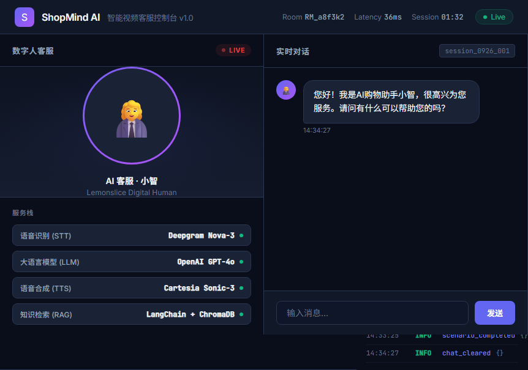

主界面采用专业深色主题，三栏布局设计：

- **顶部导航栏**：品牌标识（ShopMind AI）、Room ID、实时延迟指标、会话计时器、Live 状态指示
- **数字人客服**（左栏）：AI数字人形象展示，带渐变光环和语音动画，底部服务栈面板显示 10 行服务状态（STT/LLM/TTS/RAG + 生产保障层 + LangGraph/Multi-Agent/LangSmith/LiteLLM/FastAPI）
- **实时对话**（中栏）：聊天消息流，支持用户/AI消息气泡区分，工具调用标签（`fn tool_name`）显示
- **右侧边栏**：场景模拟控制（业务场景 2x2 + 生产就绪 P0 2x3 + v3.0 全栈 2x3）、Function Tools 列表（10个，带调用状态指示）、Structured Logs 面板（等宽字体，颜色分级）

---

## 3. 用户角色操作流程

### 3.1 客户角色 - 商品咨询

**场景描述**：客户想购买适合跑步的耳机

**操作步骤**：
1. 点击「商品咨询场景」按钮
2. 系统自动模拟以下对话流程：

| 步骤 | 角色 | 内容 | 调用工具 |
|------|------|------|----------|
| 1 | 客户 | "我想找一款适合跑步的耳机" | - |
| 2 | AI客服 | "好的，我为您搜索适合跑步的耳机" | `search_products` |
| 3 | AI客服 | "找到了！推荐智能蓝牙耳机 Pro，299元，主动降噪，续航30小时..." | `get_product_details` |
| 4 | AI客服 | "目前库存充足，有150件，黑色和白色可选" | `check_inventory` |

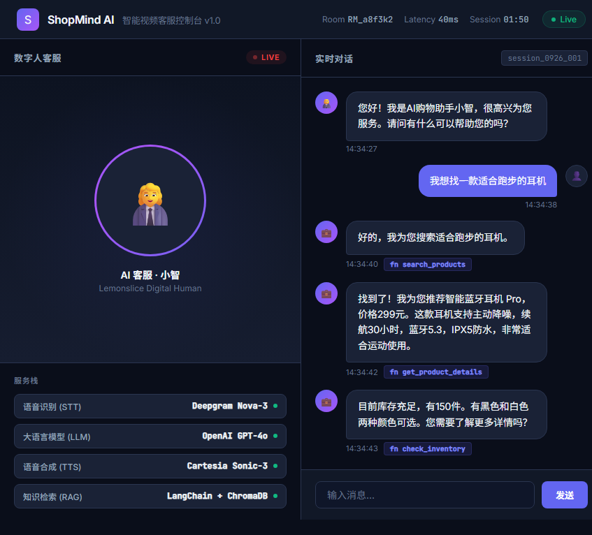

**日志输出**：
```
[INFO] [scenario_started] {"scenario":"product"}
[INFO] [tool_search_products] {"status":"success"}
[INFO] [tool_get_product_details] {"status":"success"}
[INFO] [tool_check_inventory] {"status":"success"}
[INFO] [scenario_completed] {}
```

---

### 3.2 客户角色 - 订单查询

**场景描述**：客户查询订单物流状态

**操作步骤**：
1. 点击「清空对话」按钮重置对话
2. 点击「订单查询场景」按钮
3. 系统自动模拟以下对话流程：

| 步骤 | 角色 | 内容 | 调用工具 |
|------|------|------|----------|
| 1 | 客户 | "我的订单 ORD20240101001 到哪了？" | - |
| 2 | AI客服 | "好的，我为您查询订单状态" | `query_order_status` |
| 3 | AI客服 | "您的订单已发货，包含智能蓝牙耳机 Pro（1件）和保温杯（2件），总计477元" | - |
| 4 | AI客服 | "物流信息：顺丰速运承运，运单号 SF1234567890，目前在上海浦东派送中，预计明天送达" | `get_tracking_info` |

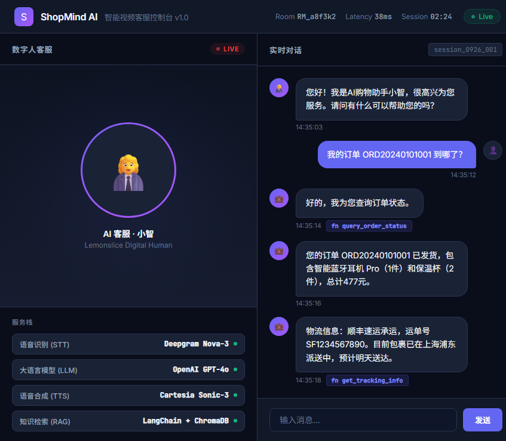

**日志输出**：
```
[INFO] [scenario_started] {"scenario":"order"}
[INFO] [tool_query_order_status] {"status":"success"}
[INFO] [tool_get_tracking_info] {"status":"success"}
[INFO] [scenario_completed] {}
```

---

### 3.3 客户角色 - 退换货

**场景描述**：客户收到鞋子后尺码不合适，申请退货

**操作步骤**：
1. 点击「清空对话」按钮重置对话
2. 点击「退换货场景」按钮
3. 系统自动模拟以下对话流程：

| 步骤 | 角色 | 内容 | 调用工具 |
|------|------|------|----------|
| 1 | 客户 | "我想退掉刚收到的鞋子" | - |
| 2 | AI客服 | "好的，请问您的订单号是多少？退换原因是什么？" | - |
| 3 | 客户 | "订单号 ORD20240102002，鞋子尺码不合适" | - |
| 4 | AI客服 | "我为您查询订单信息" | `query_order_status` |
| 5 | AI客服 | "已为您发起退货申请，退货单号 RETORD20240102002" | `initiate_return` |
| 6 | AI客服 | "退货申请已提交，预计1-2个工作日内审核。后续步骤：1) 等待审核通过 2) 按指引寄回商品 3) 商家收货后退款" | - |

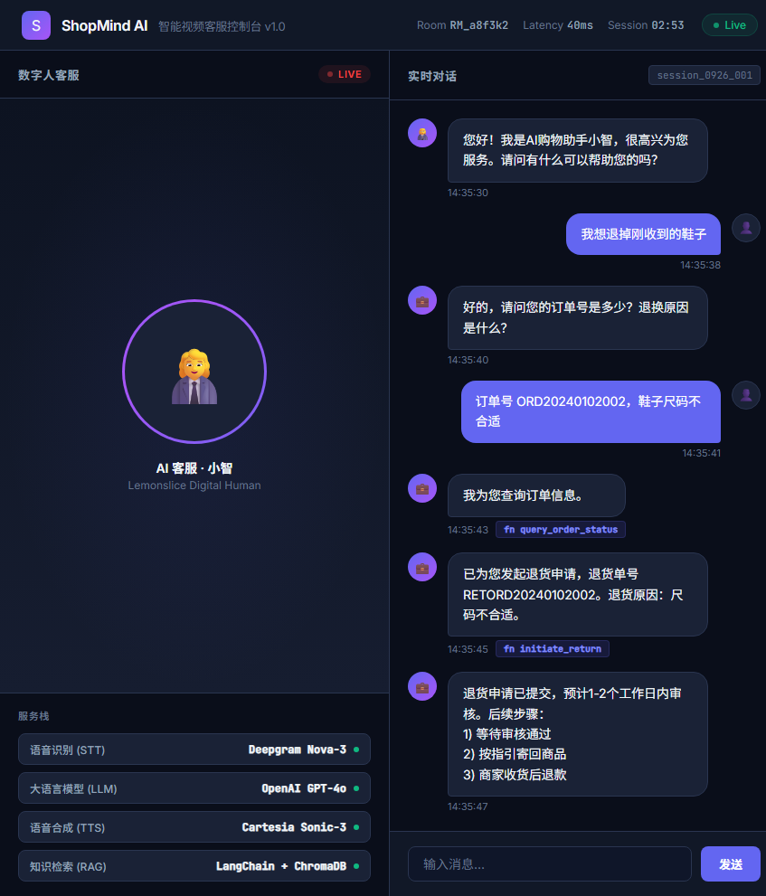

**日志输出**：
```
[INFO] [scenario_started] {"scenario":"return"}
[INFO] [tool_query_order_status] {"status":"success"}
[INFO] [tool_initiate_return] {"status":"success"}
[INFO] [scenario_completed] {}
```

---

### 3.4 客户角色 - 智能推荐

**场景描述**：客户需要推荐送女朋友的礼物，预算300-500元

**操作步骤**：
1. 点击「清空对话」按钮重置对话
2. 点击「智能推荐场景」按钮
3. 系统自动模拟以下对话流程：

| 步骤 | 角色 | 内容 | 调用工具 |
|------|------|------|----------|
| 1 | 客户 | "推荐一款送女朋友的礼物，预算300-500元" | - |
| 2 | AI客服 | "好的，我根据您的偏好和预算为您推荐商品" | `get_recommendations` |
| 3 | AI客服 | "推荐：1. 智能蓝牙耳机 Pro（299元）2. 运动跑鞋 飞翼系列（459元）" | - |
| 4 | AI客服 | "当前有'新人专享'活动，新用户首单立减20元" | `get_current_promotions` |


**日志输出**：
```
[INFO] [scenario_started] {"scenario":"recommend"}
[INFO] [tool_get_recommendations] {"status":"success"}
[INFO] [tool_get_current_promotions] {"status":"success"}
[INFO] [scenario_completed] {}
```

---

## 4. Agent 工具集详解

系统共注册 **10个 Function Tools**，覆盖电商客服全流程：

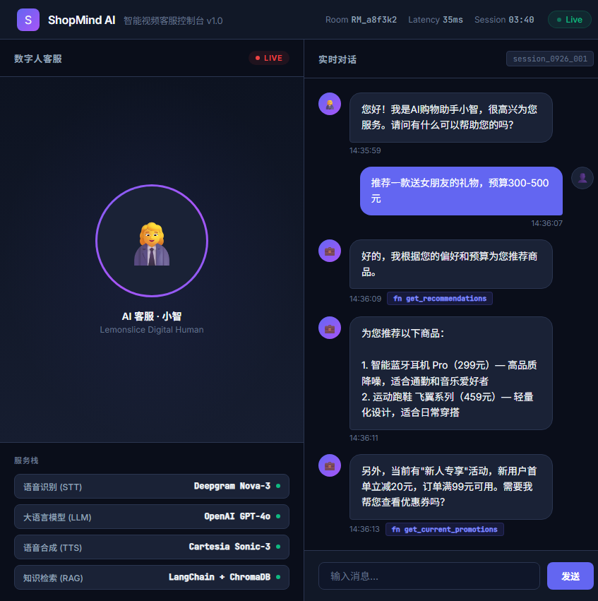

### 商品类工具（4个）

| 工具名 | 功能 | 输入参数 | 输出 |
|--------|------|----------|------|
| `search_products` | 语义搜索商品（RAG） | query, category, max_results | 商品列表 |
| `get_product_details` | 获取商品详情 | product_id | 商品规格、库存、价格 |
| `check_inventory` | 查询库存状态 | product_id, sku | 库存数量、状态 |
| `get_recommendations` | 智能商品推荐 | preference, budget_min, budget_max | 推荐列表+理由 |

### 订单类工具（4个）

| 工具名 | 功能 | 输入参数 | 输出 |
|--------|------|----------|------|
| `query_order_status` | 查询订单状态 | order_id | 订单状态、商品明细 |
| `get_tracking_info` | 物流追踪信息 | order_id | 物流节点、预计送达 |
| `initiate_return` | 发起退换货 | order_id, item_ids, reason | 退货单号、后续步骤 |
| `check_return_policy` | 查询退换政策 | product_category | 退换天数、条件 |

### 营销类工具（2个）

| 工具名 | 功能 | 输入参数 | 输出 |
|--------|------|----------|------|
| `get_current_promotions` | 获取促销活动 | category | 活动列表、优惠规则 |
| `apply_coupon` | 使用优惠券 | coupon_code, order_id | 优惠金额、使用条件 |

---

## 5. 结构化日志系统

系统采用结构化日志（Wide Events）模式，每条日志包含完整上下文：

### 日志格式

```
[时间戳] [级别] [事件名] {JSON上下文数据}
```

日志面板采用 JetBrains Mono 等宽字体，颜色分级显示：
- **INFO**（绿色）：正常业务流程
- **WARN**（黄色）：降级/重试/非关键异常
- **ERROR**（红色）：关键错误，需人工介入
- **事件名**（靛蓝色）：结构化事件标识
- **JSON数据**（灰色）：完整上下文数据

### 典型日志流

```
13:55:01 INFO session_started {"room":"RM_a8f3k2","stt":"deepgram/nova-3","llm":"openai/gpt-4o","tts":"cartesia/sonic-3"}
14:33:19 INFO scenario_started {"scenario":"product"}
14:33:21 INFO tool_search_products {"status":"success"}
14:33:23 INFO tool_get_product_details {"status":"success"}
14:33:25 INFO tool_check_inventory {"status":"success"}
14:33:25 INFO scenario_completed {}
```

---

## 6. 生产就绪保障层 (P0)

系统内置 **6大生产保障模块**，确保服务在真实生产环境中稳定运行：

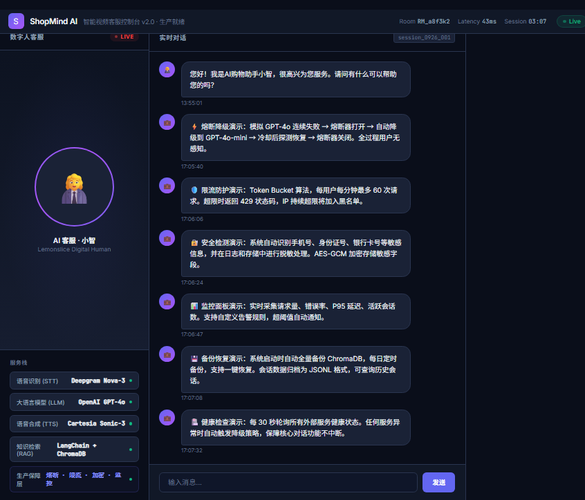

### 6.1 熔断降级

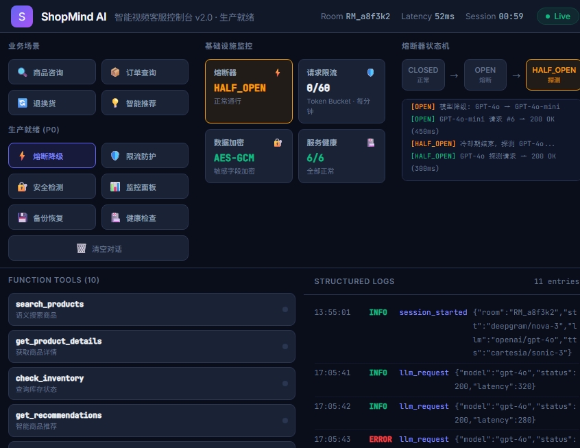

**问题**：LLM 服务（OpenAI）不可用时，系统会持续报错，用户无法获得响应。

**方案**：实现熔断器状态机（CLOSED → OPEN → HALF_OPEN → CLOSED）+ 模型降级链（GPT-4o → GPT-4o-mini）。

| 状态 | 行为 | 触发条件 |
|------|------|----------|
| **CLOSED** | 正常请求 GPT-4o | 连续失败 < 5 次 |
| **OPEN** | 直接降级到 GPT-4o-mini | 连续失败 ≥ 5 次 |
| **HALF_OPEN** | 试探性请求 GPT-4o | 冷却期结束（30s） |
| **CLOSED** | 恢复正常 | 试探请求成功 |

**关键参数**：
- 失败阈值：5 次连续失败
- 冷却时间：30 秒
- 降级链：GPT-4o → GPT-4o-mini → 预设回复

### 6.2 限流防护

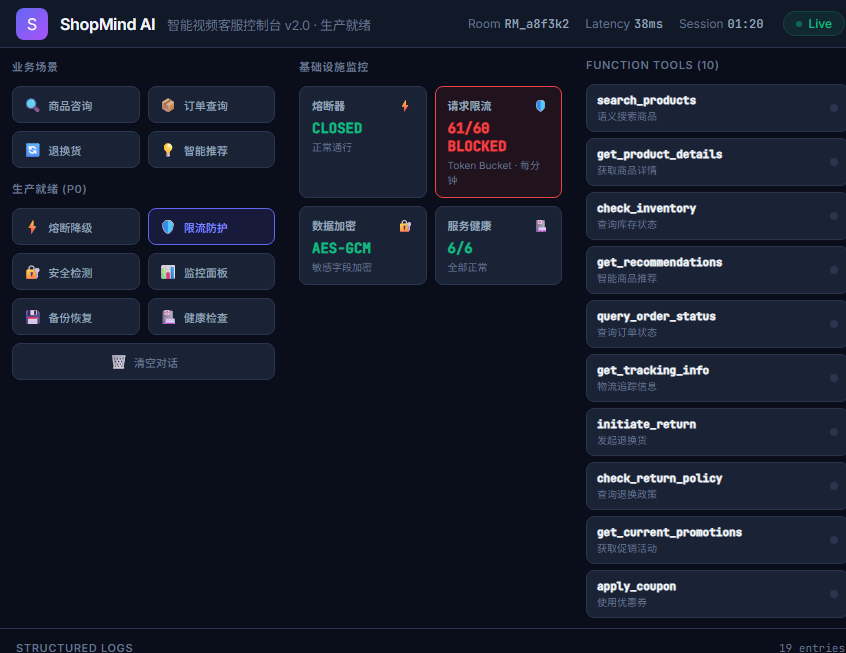

**问题**：恶意用户或异常流量可能导致 API 费用暴增、服务过载。

**方案**：Token Bucket 算法，每用户每分钟最多 60 次请求。

| 指标 | 值 | 说明 |
|------|-----|------|
| 令牌桶容量 | 60 | 每分钟最大请求数 |
| 填充速率 | 1 令牌/秒 | 匀速补充 |
| 超限行为 | 返回 429 | Too Many Requests |
| 持续超限 | IP 加入黑名单 | 连续 3 次超限 |

### 6.3 安全检测

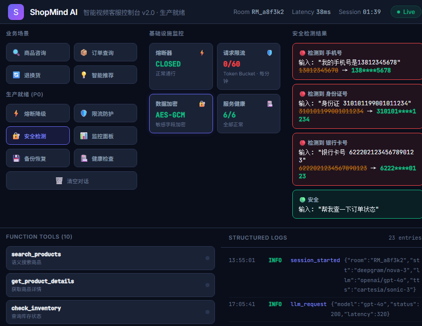

**问题**：用户可能在对话中发送手机号、身份证号、银行卡号等敏感信息，直接存储存在泄露风险。

**方案**：正则检测 + AES-GCM 加密存储 + 日志脱敏。

| 检测类型 | 正则模式 | 脱敏示例 |
|----------|----------|----------|
| 手机号 | 11位数字，1开头 | `13812345678` → `138****5678` |
| 身份证号 | 18位，末位可为X | `310101199001011234` → `310101****1234` |
| 银行卡号 | 16-19位数字 | `6222021234567890123` → `6222****0123` |

**加密方案**：AES-256-GCM，敏感字段加密后存储，密钥通过环境变量注入。

### 6.4 监控面板

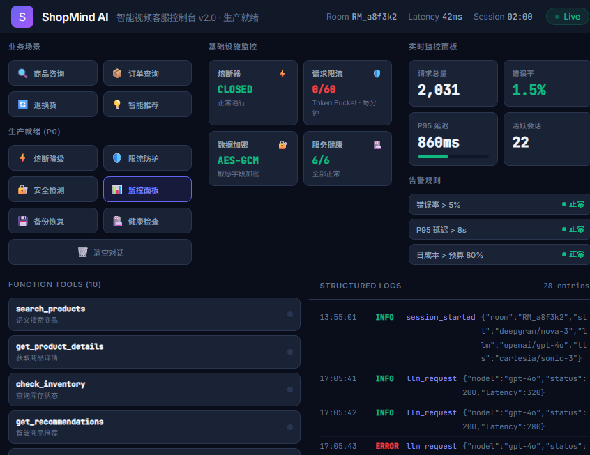

**问题**：生产环境缺乏可观测性，问题发现滞后。

**方案**：实时指标采集 + 告警规则引擎。

**核心指标**：

| 指标 | 类型 | 说明 |
|------|------|------|
| 请求总量 | Counter | 累计请求数 |
| 错误率 | Gauge | 错误请求占比 |
| P95 延迟 | Histogram | 95分位响应时间 |
| 活跃会话 | Gauge | 当前在线会话数 |

**告警规则**：

| 规则 | 阈值 | 级别 |
|------|------|------|
| 错误率过高 | > 5% | WARNING |
| P95 延迟过高 | > 8s | WARNING |
| 日成本超预算 | > 80% | CRITICAL |

### 6.5 备份恢复

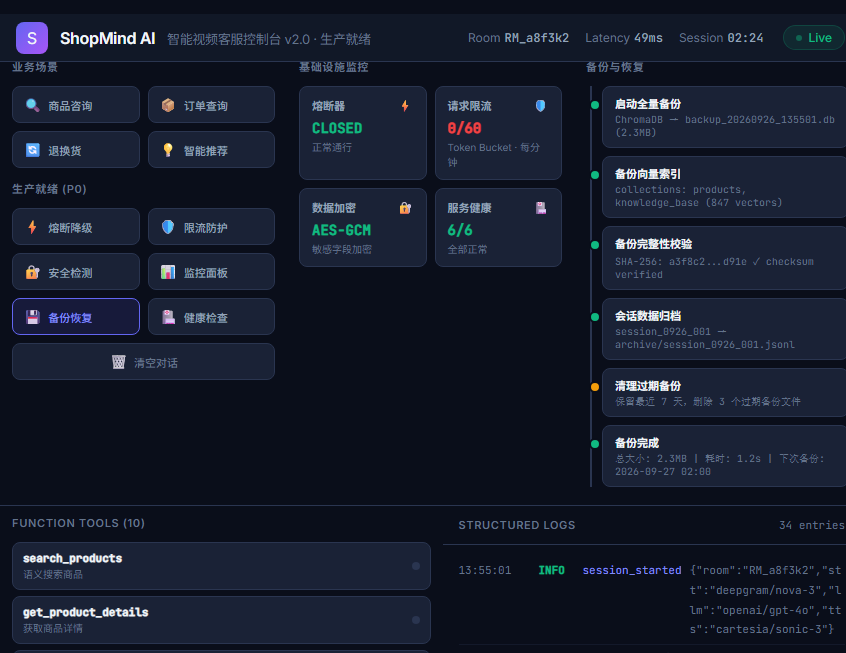

**问题**：ChromaDB 向量数据库数据丢失将导致商品知识全部丢失。

**方案**：定时全量备份 + 会话归档 + 完整性校验。

| 步骤 | 说明 |
|------|------|
| 全量备份 | ChromaDB → SQLite 备份文件 |
| 向量索引备份 | 备份所有 collection 的向量数据 |
| 完整性校验 | SHA-256 checksum 验证 |
| 会话归档 | 会话数据归档为 JSONL 格式 |
| 过期清理 | 保留最近 7 天，自动删除过期备份 |

### 6.6 健康检查

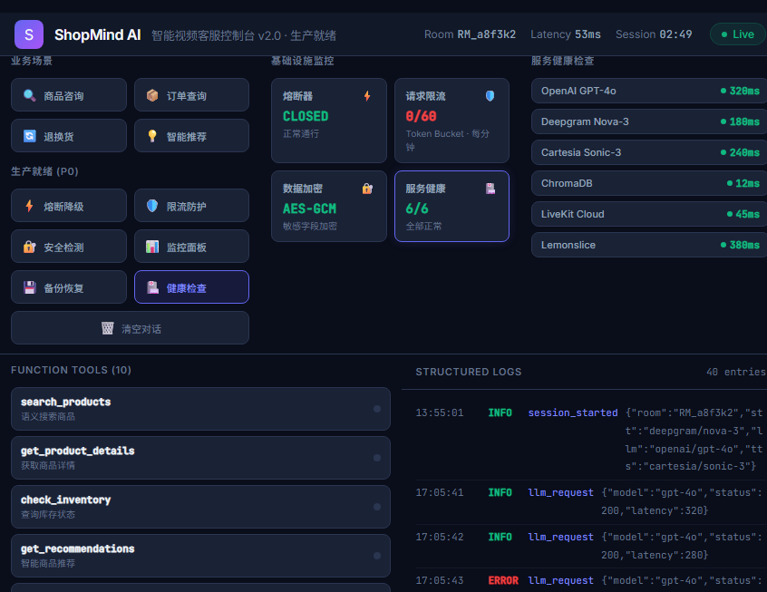

**问题**：外部服务（OpenAI、Deepgram 等）不可用时无法及时发现。

**方案**：每 30 秒探测所有外部服务健康状态。

| 服务 | 探测方式 | 超时 |
|------|----------|------|
| OpenAI GPT-4o | API 连通性 | 5s |
| Deepgram Nova-3 | WebSocket 连通性 | 3s |
| Cartesia Sonic-3 | API 连通性 | 5s |
| ChromaDB | 本地心跳 | 2s |
| LiveKit Cloud | API 连通性 | 5s |
| Lemonslice | API 连通性 | 5s |

---

## 7. v3.0 全栈 AI Agent 能力

系统升级至 v3.0，新增 **7大工程化能力**，覆盖 AI Agent 岗位全部技术要求：

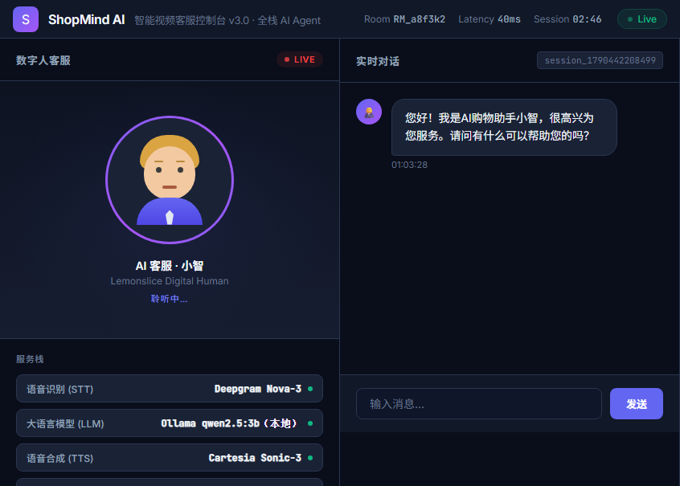

### 7.1 LangGraph 流程编排

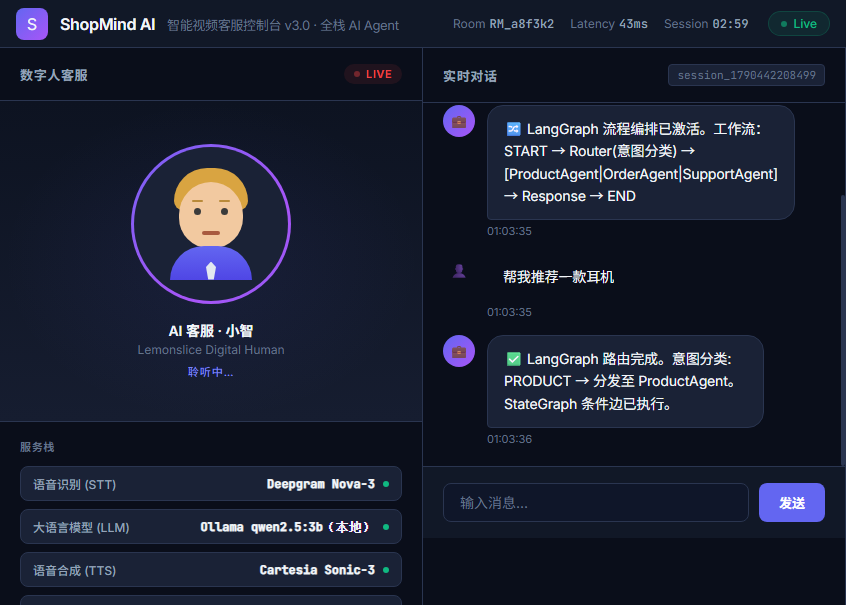

**能力**：基于 LangGraph StateGraph 的意图路由工作流。

**工作流**：
```
START → Router(意图分类) → [ProductAgent | OrderAgent | SupportAgent] → Response → END
```

**意图分类**：关键词评分机制，覆盖 3 类意图 + UNKNOWN 兜底。

| 意图 | 关键词示例 | 路由目标 |
|------|-----------|----------|
| PRODUCT | 商品、价格、库存、推荐、多少钱 | ProductAgent |
| ORDER | 订单、物流、快递、退货、退款 | OrderAgent |
| SUPPORT | 你好、帮助、怎么、投诉、人工 | SupportAgent |
| UNKNOWN | 无匹配关键词 | Response（兜底回复） |

**演示操作**：点击「🔀 LangGraph」按钮，观察对话流中的路由路径和条件边执行日志。

### 7.2 Multi-Agent Supervisor

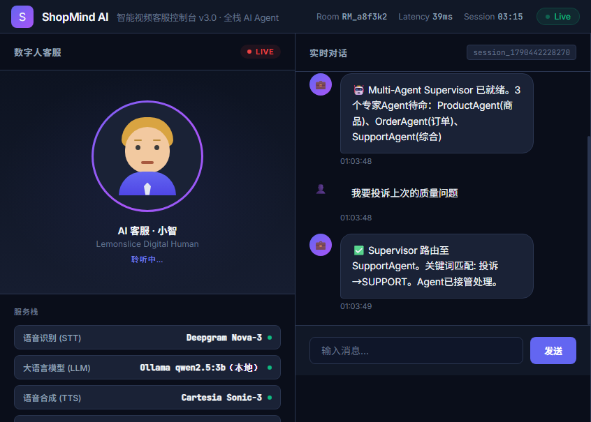

**能力**：Supervisor 模式调度 3 个专家 Agent。

| Agent | 职责 | 工具集 |
|-------|------|--------|
| ProductAgent | 商品搜索、详情、库存、推荐 | search_products, get_product_details, check_inventory, get_recommendations |
| OrderAgent | 订单查询、物流追踪、退换货 | query_order_status, get_tracking_info, initiate_return, check_return_policy |
| SupportAgent | 通用客服、投诉处理、人工转接 | get_current_promotions, apply_coupon |

**演示操作**：点击「🤖 Multi-Agent」按钮，观察 Supervisor 路由至 SupportAgent 处理投诉场景。

### 7.3 LangSmith 可观测性

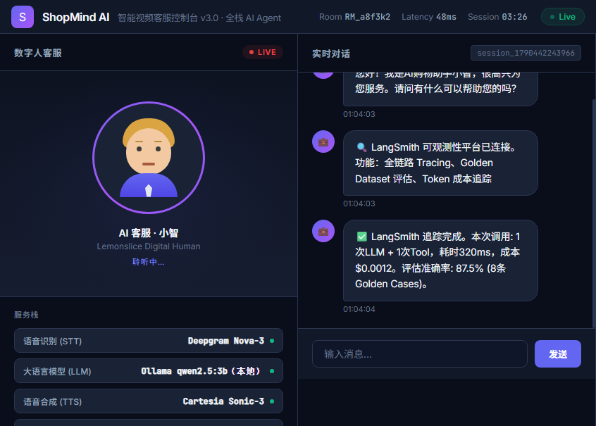

**能力**：全链路 Tracing + Golden Dataset 评估 + Token 成本追踪。

| 功能 | 说明 |
|------|------|
| Tracing | 每次 LLM 调用记录 model/prompt/latency/tokens |
| Golden Eval | 8 条标准测试用例，评估准确率 |
| Cost Tracking | 按模型计费（GPT-4o $2.50/M input, $10/M output） |
| Budget Alert | 日预算 $50，超 80% 触发 CRITICAL 告警 |

**演示操作**：点击「🔍 LangSmith」按钮，观察 Tracing 完成日志和评估准确率。

### 7.4 FastAPI REST API

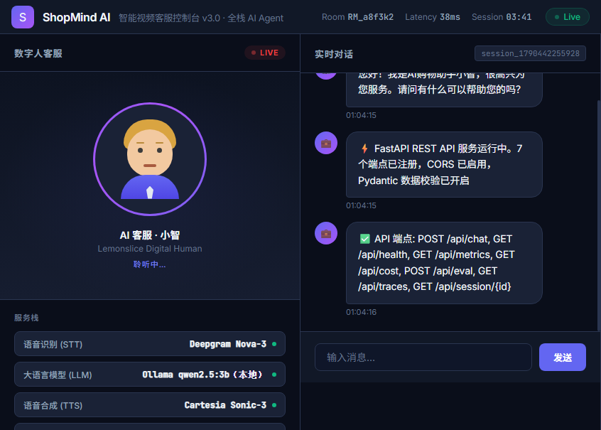

**能力**：7 个 REST 端点，Pydantic 数据校验，CORS 已启用。

| 端点 | 方法 | 功能 |
|------|------|------|
| /api/chat | POST | 发送消息，返回 AI 响应 + intent + agent + latency |
| /api/session/{id} | GET | 获取会话信息和历史消息 |
| /api/metrics | GET | 系统指标快照（counters/gauges/histograms） |
| /api/health | GET | 健康检查，返回 healthy/degraded |
| /api/eval | POST | 运行评估，返回准确率 |
| /api/cost | GET | 成本追踪汇总 |
| /api/traces | GET | 最近 50 条 Tracing 记录 |

**演示操作**：点击「⚡ FastAPI」按钮，观察 API 端点注册和 Pydantic 校验日志。

### 7.5 LiteLLM 模型路由

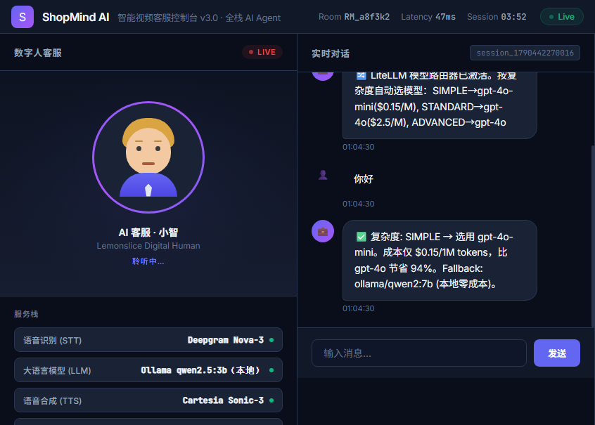

**能力**：按消息复杂度自动选择模型，优化成本。

| 复杂度 | 模型 | 成本 ($/1M tokens) | 适用场景 |
|--------|------|---------------------|----------|
| SIMPLE | gpt-4o-mini | $0.15 input / $0.60 output | 问候、政策查询、简单问答 |
| STANDARD | gpt-4o | $2.50 input / $10.00 output | 商品搜索、订单查询、推荐 |
| ADVANCED | gpt-4o | $2.50 input / $10.00 output | 投诉处理、多步推理、对比分析 |

**降级链**：gpt-4o → gpt-4o-mini → ollama/qwen2:7b（本地零成本）。

**演示操作**：点击「 LiteLLM」按钮，观察复杂度分类和模型选择日志。

### 7.6 Ollama 本地模型

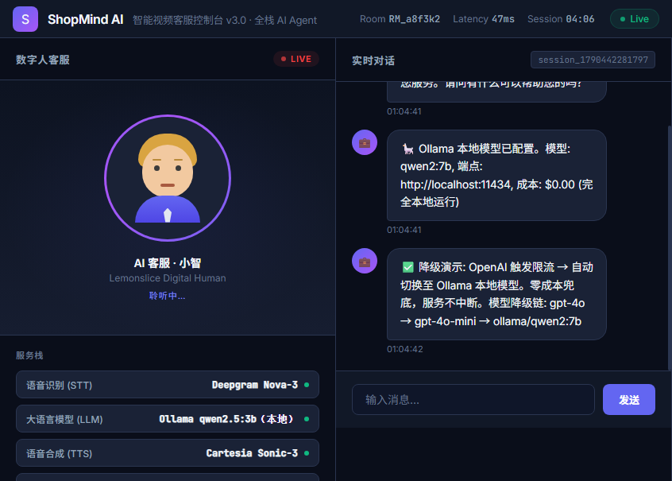

**能力**：本地部署 qwen2:7b 模型，零 API 成本，完全离线运行。

| 配置项 | 值 |
|--------|-----|
| 模型 | qwen2:7b |
| 端点 | http://localhost:11434 |
| 成本 | $0.00（完全本地） |
| 用途 | 最终降级兜底，OpenAI 不可用时自动切换 |

**演示操作**：点击「🦙 Ollama」按钮，观察降级演示：OpenAI 触发限流 → 自动切换至 Ollama 本地模型，服务不中断。

### 7.7 v4.0 真实推理链路（本地 LLM + 混合语义检索 + 电商联动）

以上 7.1–7.6 为控制台场景模拟；v4.0 起 `/api/chat` 全链路为**真实调用**，无任何硬编码回复：

| 环节 | 实现 | 说明 |
|------|------|------|
| 语义检索 | ChromaDB + `nomic-embed-text`（768维真实向量，68商品） | 文档/查询分别加 `search_document:` / `search_query:` 前缀 |
| 混合排序 | `_hybrid_merge`：关键词优先 + RRF 融合 | 中文字面命中走精确关键词；改述句（如"能自动翻译外语的设备"）由向量召回 |
| 回复生成 | Ollama 本地 `qwen2.5:3b` | 检索结果注入上下文，LLM 基于真实商品数据作答 |
| 商品卡片 | 京东/拼多多搜索直达链接 | 按价格升序，最低价绿色「最低」角标，点击新标签页跳转 |
| 工具标记 | `tools_used` 如实上报 | 仅在实际调用时标记 `rag_search` / `ollama_chat`，不造假 |
| 降级保障 | Ollama 不可用 → 关键词检索 + 意图识别兜底 | 兜底回复引用用户原问题，绝不答非所问 |

**验证截图**：

直译查询——「有没有实时翻译眼镜推荐」，LLM 推荐 + 3 张眼镜比价卡：

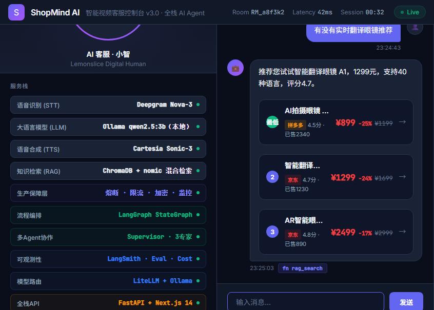

改述查询——「出国旅游想带个能自动翻译外语的设备」（不含"眼镜"字样），纯语义命中同款商品：

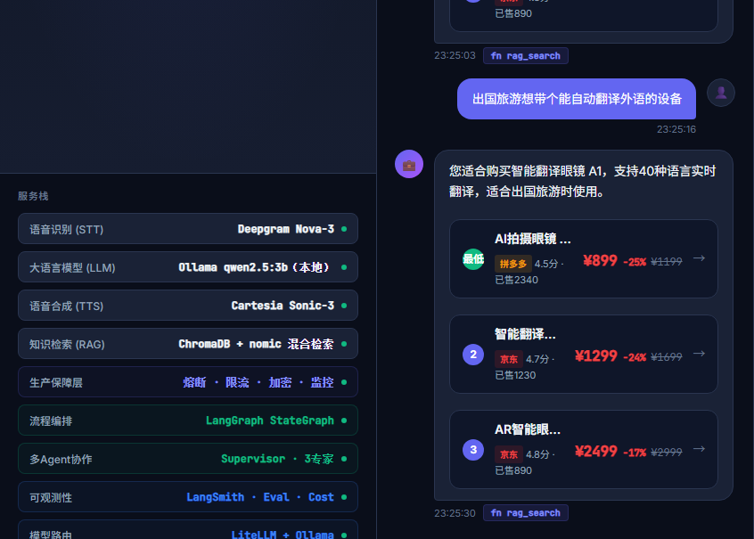

**本地启动**：

```bash
# 1. 启动 Ollama（默认已在 :11434 运行）
#    模型：qwen2.5:3b（LLM）+ nomic-embed-text（向量）
ollama list

# 2. 启动后端（Python 3.12，首次请求自动重建向量索引，约3分钟）
PYTHONPATH=src python -m uvicorn src.api.server:app --host 0.0.0.0 --port 8000

# 3. 浏览器打开 docs/demo.html，输入商品类问题验证
```

> 注意：修改商品数据或嵌入逻辑后需删除 `data/chroma_db` 触发重建。

---

## 8. 快速开始

### 8.1 环境准备

```bash
# 安装依赖
pip install -e .

# 配置环境变量
cp .env.example .env
# 编辑 .env 填入 API Keys
```

### 8.2 启动服务

```bash
# 开发模式（带热重载）
python src/agent.py dev

# 控制台模式（本地测试）
python src/agent.py console

# FastAPI 后端（独立启动）
uvicorn src.api.server:app --reload --port 8000

# Next.js 前端（独立启动）
cd frontend && npm install && npm run dev
```

### 8.3 运行测试

```bash
pytest tests/ -v
```

### 8.4 查看演示

在浏览器中打开 `docs/demo.html` 查看交互式演示。

---

## 9. 二次开发

### 9.1 添加新工具

在 `src/tools/` 下创建新工具文件，然后在 `ecommerce_agent.py` 中注册：

```python
@function_tool
async def my_new_tool(self, context: RunContext, param: str) -> str:
    """工具描述..."""
    return "result"
```

### 9.2 扩展知识库

在 `data/knowledge_base/` 添加 Markdown 文件，运行：

```bash
python scripts/ingest_knowledge.py
```

### 9.3 自定义数字人形象

修改 `src/agent.py` 中的 `agent_image_url` 和 `agent_prompt` 参数。

---

## 10. 项目结构

```
ecommerce-video-cs/
├── src/
│   ├── agent.py                    # 主入口
│   ├── agent/
│   │   ├── ecommerce_agent.py      # 电商客服Agent
│   │   └── multi_agent.py          # Multi-Agent Supervisor
│   ├── graph/
│   │   └── workflow.py             # LangGraph StateGraph
│   ├── api/
│   │   └── server.py               # FastAPI REST API
│   ├── tools/
│   │   ├── product_tools.py        # 商品工具（4个）
│   │   └── order_tools.py          # 订单工具（4个）
│   ├── knowledge/
│   │   └── rag_engine.py           # RAG知识引擎
│   └── utils/
│       ├── logging.py              # 结构化日志
│       ├── resilience.py           # 熔断降级 + 模型降级链 + Ollama
│       ├── security.py             # 加密 + 限流 + 敏感信息检测
│       ├── monitoring.py           # 指标采集 + 告警 + 健康检查
│       ├── backup.py               # 备份管理 + 会话归档
│       ├── langsmith_integration.py # LangSmith Tracing + Eval + Cost
│       └── litellm_router.py       # LiteLLM 模型路由 + 成本追踪
├── frontend/                       # Next.js 14 前端
├── data/
│   ├── products/                   # 商品数据
│   └── knowledge_base/             # 知识库
├── tests/                          # 单元测试（117个）
├── docs/
│   ├── demo.html                   # 交互式演示 (v3.0)
│   ├── screenshots/                # 操作截图 (19张)
│   ├── 操作指南.md                 # 本文档
│   └── 生产就绪测试报告.md         # 生产就绪报告 (96%)
├── scripts/start.py                # 启动脚本
└── README.md
```
